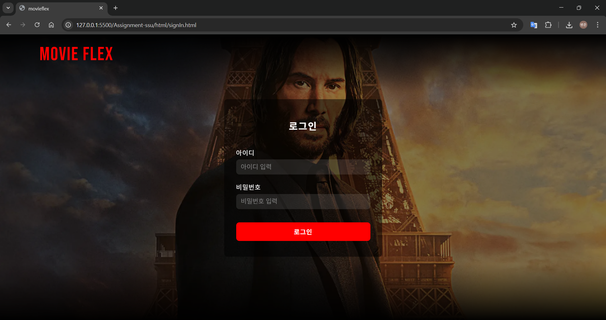
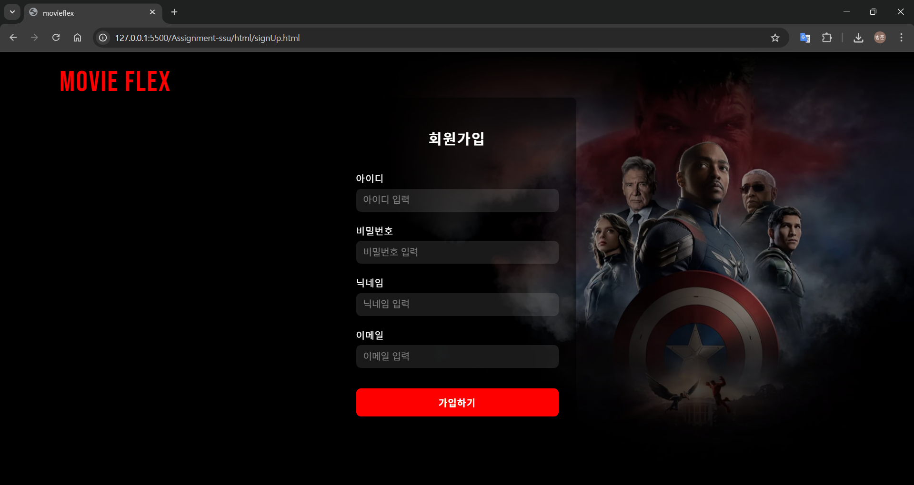
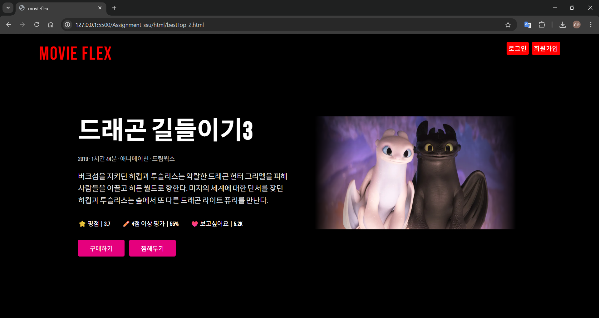
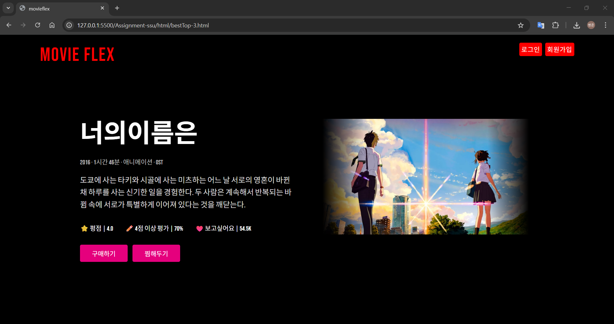
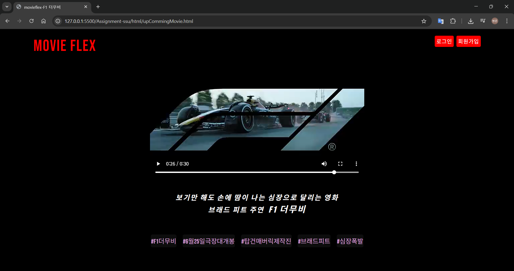
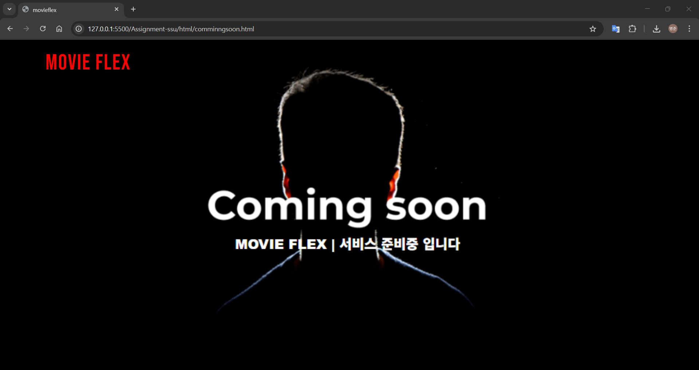

# 🎬 Movie Flex
> SSU 인터넷활용Ⅰ 과제

### 🎥 메인 페이지 실행 화면

---

### 📸 스크린샷

#### 🔐 로그인

#### 📝 회원가입

#### 🏆 인기 TOP7 페이지
| TOP 2 | TOP 3 |
|-------|-------|
|  |  |

#### 🎞️ 개봉 예정작

#### 🚧 미완성 페이지
> 미완성 링크는 `Coming soon` 페이지로 연결하여 사용자 경험 개선

---
#### 🛠️ 사용 기술

#### ▶️ 실행 방법
***방법 1. VS Code 로 Live Server 실행***
> ✅ 추천하는 방식

***방법 2. index.html 브라우저에서 바로 실행***
> ⚠️ 단, 일부 링크가 정상 작동하지 않을 수 있습니다.